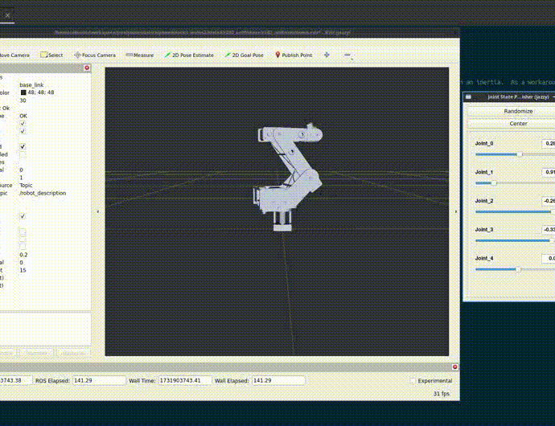
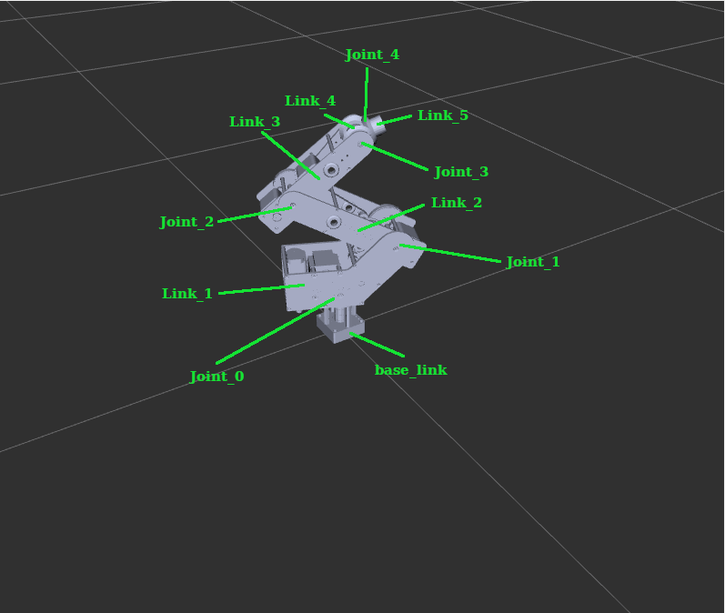

[**r2d2** (ros2dorna2)](https://github.com/pinorobotics/r2d2) - set of ROS2 packages which provide support for [Dorna2 robotic arm](https://dorna.ai/).

**r2d2_urdf** package contains URDF definitions for Dorna2 robotic arm

The original URDF was taken from [Perceptive-Pick-And-Place-Robot](https://github.com/ShaySackett/Perceptive-Pick-And-Place-Robot).

NOTE: This is unofficial Dorna ROS2 package. For official Dorna software follow https://dorna.ai/

[](example.gif)

[](links_naming.png)

# Build

```
cd <ROS WORKSPACE>
colcon build
```

Setup environment (for zsh replace to "setup.zsh"):
```
source install/setup.bash
```

# Run

``` bash
ros2 launch r2d2_urdf demo_launch.py use_gui:=true
```

# Documentation

- [r2d2](https://github.com/pinorobotics/r2d2)

# Contacts

aeon_flux <aeon_flux@eclipso.ch>
